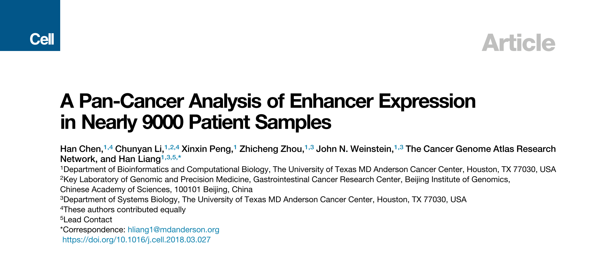

## Abstract

​	这是4月份发表在Cell上的一篇数据挖掘类的文章，研究对象是==增强子==。作者的工作可以划分为5个部分：

* Overview of Enhancer Expression in Human Cancers

* Global Enhancer Activation in Cancer Is Positively Associated with Tumor Aneuploidy

* A ‘‘Chromatin-State’’-Centered Model for the Interplay of Enhancer Activation, SCNAs, and Point Mutations

* Systematic Identification of Causal Enhancer-Cancer Gene Interactions

* Enhancers of Actionable Genes Show Potential Clinical Relevance

​        文章第一部分描绘了增强子在人类癌症中的全局表达情况；第二部分探索了癌症中增强子表达和体细胞突变的联系；第三部分基于第二部分的结果建立了一个解释模型然后进行验证；第四部分开发了一个推断enhancer-gene直接因果互作关系的计算流程；第五部分具体分析了第四部分挖掘出的关系对中的两对。

## RESULTS

 ### 一、Overview of Enhancer Expression in Human Cancers

第一部分，使用TCGA的RNA-seq数据表征增强子在人类癌症中的表达。

1. 首先，从[FANTOM][2]项目中注释的~65000个增强子中过滤得到15808个增强子用于进一步分析；

   

2. 分析这15808个增强子及其侧翼1-kb的染色质状态（== DNase hypersensitivity ==, == p300 binding ==, == CTCF binding ==, == H3K27Ac ==和== H3K4Me1 ==）。结果证实了这15808个增强子是真正的增强子，而不是其它转录单位或转录噪声。

   

3. 使用TCGA中33个癌症类型的8928个癌症病人样本的RNA-seq数据，分析这15808个增强子的表达概况，结果发现增强子在大多数癌症中都表现出全局增强子的激活。

   

###二、Global Enhancer Activation in Cancer Is Positively Associated with Tumor Aneuploidy

第二部分，探索癌症中增强子表达与somatic copy-number alteration (SCNA) 、 point mutation两个最常见的体细胞突变之间的联系。

1. 首先，使用来自Affymetrix SNP6.0 arrays的== aneuploidy 值 ==（defined as the fraction of the genome affected by SCNAs）、来自whole-exome sequencing的silent somatic mutations的总数量分别定量全局SCNA水平、mutation burden。对于每一种癌症类型使用Spearman’s correlation analysis探索全局增强子表达水平（RPM）同SCNA、点突变的相关性。结果表明：全局增强子激活水平与SCNA水平正相关，而与点突变没有相关性或微弱的负相关。

   

2. 为了进一步探索增强子在癌症类型间的表达模式，作者对癌症样本做了consens clustering，结果得到3个不受癌症类型影响的3个簇：C1、C2、C3。

   

3. 对这3个簇在SCNA和突变负载两个方面进行表征。

   

4.综上所述，增强子激活与基因组不稳定性的相关性可以概括为一棵树。亚型C1富含高突变载和低异倍性水平的样本；亚型C2富含具有高突变负载和高异倍性水平的样本；亚型C3是“类正常”，具有低的突变和低的异倍性。癌症类型内和癌症类型间的分析都表明SCNAs，而不是点突变，与增强子激活正相关。

   

### 三、A ‘‘Chromatin-State’’-Centered Model for the Interplay of Enhancer Activation, SCNAs, and Point Mutations

第三部分，针对于上一部分得到的结果，提出一个假设模型，用来解释为什么SCNAs和点突变与癌症中全局增强子的激活有不同的关系（甚至在某种程度上，在某些癌症类型中相反）?

1. 提出的假设模型。染色质紧密的状态下，增强子沉默，生物体内的DNA修复机制不能进入行使修复功能，所以点突变负载高；一旦染色质开放，增强子可能被激活，由于展开的DNA被拉长1-2个数量级，长距离的DNA-DNA互作会增加DNA重排的机会（SCNAs）。

   

2. 利用全基因组测序得到的SCNA和突变数据验证假设模型。将人类基因组划分为2663个1-Mb的片段，使用来自COSMIC的全基因组数据计算每个片段的突变率和DNA双链断裂率（DSB），计算片段上所有增强子区域的平均RPKM。DNase hypersensitivity 和 histone-modifications来自于ENCODE ChIP-seq数据，DNA-DNA互作密度使用Hi-C数据。然后分别计算这3个数值与5个基因组特征的Spearman’s correlation coefficients（p<10^ -16 ^）。

   

3. 进一步检验使用DNA-DNA互作解释增强子活性同SCNAs的相关性。统计500个10-kb的具有最高DSB率的人类基因组片段与Hi-C loop anchors重叠的程度。

   

4. 假设模型展示了染色质的开放如何帮助DNA结构的重组。

   

### 四、Systematic Identification of Causal Enhancer-Cancer Gene Interactions

第四部分，识别增强子下游的靶基因，以阐明某个增强子在癌症发育中的分子功能，并评估它们的临床实用性。

1. 综合enhancer和mRNA的co-expression分析，可以得到某个增强子的候选靶基因集合。给定某个enhancer-gene共表达组合，至少有3种可能的关系模型：

   1). causal relationship;

   2). reactive relationship;

   3). co-responsive relationship.

   为了将因果关系从中区分开来，使用eQTL信息。只有符合因果关系，影响增强子活性的SNP才能够影响下游靶基因的表达，从而使这个SNP成为这个基因的eQTL。然后使用Hi-C数据判断得到的因果关系enhancer-gene对是否是直接调控关系。

   

2. 按照上面的逻辑，开发了一个计算方法识别潜在的enhancer-gene直接因果调控关系：

   * 1). 筛选增强子集：要求增强子附近<500bp内至少有一个在[1000 Genomes Project](http://www.internationalgenome.org/)或[GTEx](https://www.gtexportal.org/)数据库中注释的SNP；

   * 2). 构建基因集：组合了clinically actionable genes (i.e., biomarkers or therapeutic targets) (n = 126), [OncoKB](http://oncokb.org/) (n = 476), 和 [CGC](https://cancer.sanger.ac.uk/census)(n = 567)一共882个癌症基因集；

   * 3). co-expression分析：要求在33个癌症类型中≥4个类型中absolute Spearman’s rho > 0.3 并且FDR < 10^ -4 ^；

   * 4). 推断因果关系：判断给定enhancer-gene共表达对的enhancer上的SNP是否是gene的eQTL；

   * 5). 推断直接调控：结合Hi-C长距离DNA-DNA互作数据判断enhancer和gene是否位于DNA loop 的anchor；

   * 6). 构建enhancer-gene直接因果调控网络。

   

   

3. 利用这个计算流程共识别了涉及49个增强子和47个癌症基因的65对enhancer-cancer gene关系。然后对这些关系对进行表征，发现大多倾向于致癌和正调控。

   

### 五、Enhancers of Actionable Genes Show Potential Clinical Relevance

第五部分，具体分析了上面识别的enhancer-cancer gene关系对中的2对。

1. enhancer22-*SYK*：可以作为预后标记。

   * 1). enhancer22及其侧翼在ENCODE ChIP-seq数据集中注释了大量的protein-DNA互作峰；
     

   * 2). 增强子内3个SNP都是*SYK*的eQTL，1000 Genomes Project RNA-seq数据集中，与C-allele相比，SNP rs5770772的T-allele与增强子22和*SYK*的高表达相关；

     

   * 3). 分析TCGA的蛋白表达谱表明enhancer22较高的活性与*SYK*蛋白较高的表达水平相关；

     

   * 4). 使用enhancer22作生存分析。

     

2. enhancer9-*PD-L1*:可以作为治疗响应的预测标记。*PD-L1*可以帮助癌症逃避免疫系统的攻击，也因此成为“check-point inhibition”免疫疗法的主要靶标，enhancer9位于*PD-L1*的~140kb左右。

   * 1). 在不同癌症中观察enhancer9和*PD-L1*之间的共表达；

     

   * 2). 使用[CCLE](https://portals.broadinstitute.org/ccle)数据集的130个肺癌细胞系验证这个共表达；

     

   * 3). 某个*PD-L1*的eQTL紧靠enhancer9表明enhancer9作为上游调控分子；

     

   * 4). 来自7个人类细胞系的Hi-C数据进一步证实了enhancer9-*PD-L1*之间直接的互作；

     

   * 5). 在ENCODE项目中研究的161个转录因子中，发现NF-~k~B是唯一与enhancer9有关的注释。ChIP-seq数据表明在enhancer9上和*PD-L1*启动子p65结合域上都有强烈的NF-~k~B结合信号，表明NF-~k~B复合体参与到enhancer9-*PD-L1*的互作，而NF-~k~B二聚体已被报告对*PD-L1*的激活是必要的；

     

   * 6). 为了验证enhancer9对*PD-L1*表达的因果效应，设计了3对single-guide CRISPR/Cas9 RNAs (sgRNAs)去删除enhancer9。enhancer9的敲除大大缩减了*PD-L1*在mRNA水平和蛋白质水平的表达（~10-fold），并且很大程度地屏蔽了IFN-γ (activating NF-~k~B)对PD-L1表达的诱导效应（~80%缩减）；

     

     

   * 7). 总的来说，这些结果表明了NF-~k~B介导的*PD-L1* 激活的enhancer-promoter互作模型。

     

[1]: [Chen H, Li C, Peng X, Zhou Z, Weinstein JN, Cancer Genome Atlas Research N, et al. A Pan-Cancer Analysis of Enhancer Expression in Nearly 9000 Patient Samples. Cell. 2018;173(2):386-99 e12. Epub 2018/04/07. doi: 10.1016/j.cell.2018.03.027. PubMed PMID: 29625054.](https://doi.org/10.1016/j.cell.2018.03.027)

[2]: [Andersson, R., Gebhard, C., Miguel-Escalada, I., Hoof, I., Bornholdt, J., Boyd, M., Chen, Y., Zhao, X., Schmidl, C., Suzuki, T., et al. (2014). An atlas of active enhancers across human cell types and tissues. Nature 507, 455–461.][https://www.nature.com/articles/nature12787]